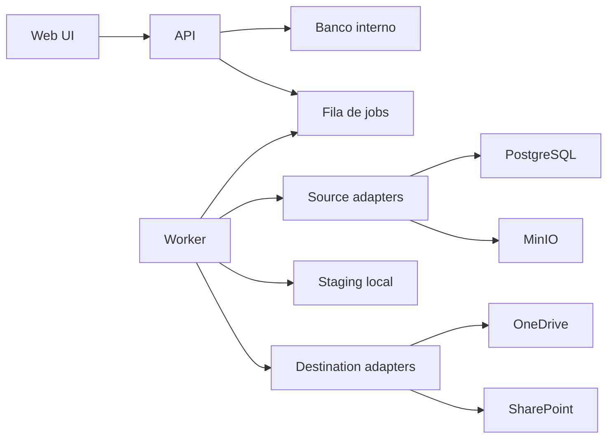

# Arquitetura

## Visao geral

SnapVault e composto por:

- Web app.
- API.
- Banco interno.
- Worker de jobs.
- Adaptadores de fontes.
- Adaptadores de destinos.
- Area local de staging.

## Componentes

### Web app

Responsavel por:

- Login.
- Onboarding.
- CRUD de fontes, destinos e politicas.
- Visualizacao de execucoes.
- Acoes manuais de backup e restore.

### API

Responsavel por:

- Autenticacao.
- Validacao de entrada.
- Persistencia.
- Criacao de jobs.
- Consulta de status.
- Orquestracao de testes de conexao.

### Worker

Responsavel por:

- Executar jobs.
- Chamar adapters.
- Registrar logs.
- Atualizar status.
- Aplicar retencao.

### Banco interno

Armazena:

- Usuarios.
- Fontes.
- Destinos.
- Politicas.
- Jobs.
- Artefatos.
- Logs.
- Segredos criptografados.

### Staging local

Diretorio temporario usado durante a criacao, compressao, criptografia e upload dos backups.

Requisitos:

- Caminho configuravel.
- Limpeza apos sucesso.
- Limpeza segura apos falha quando possivel.
- Limite de uso de disco configuravel.

## Padrao de extensibilidade

Novas fontes e destinos devem implementar contratos padronizados.

Fonte:

- `testConnection`
- `estimate`
- `backup`
- `prepareRestore`
- `restore`

Destino:

- `testConnection`
- `put`
- `get`
- `list`
- `delete`
- `stat`

## Decisoes iniciais

- O core nao deve conhecer detalhes de OneDrive, SharePoint, MinIO ou PostgreSQL.
- O core deve falar com interfaces internas.
- Adapters podem usar binarios externos como `rclone`, `pg_dump` e `mc`.
- Todas as execucoes devem produzir logs estruturados.
